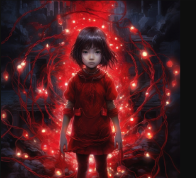

## Demostration of Midjourney's "/blend" and "/describe" commands. 

 - Midjourney will that first combines 2 images into one.  
 - Describe the image.  
 - Generate a whole new picture based on Midjourney's description.  
 ---
 

---
## First I select my images.

The first is fractal art I created in a program called Ultra Fractal.   Basically a the dragon region of mandelbrot set with kaleidoscope mapping applied.
> 

---

Another image previously created by Midjourney
> 

## Next step is to load the images into Midjourney's discord server...
> 

## Midjourney "blends" the images together.

> 

## I choose to upgrade image #3

> 

---
## Demostration of Midjourney's "/describe" command

### I chose Midjourney's decription #4 

> "an image of a little girl dressed in red with lights, in the style of gothic illustration, symmetrical chaos, anime art, intricate psychedelic landscapes, psychological phenomena illustrations, dark azure, burned/charred"

> 

---
## MidJourney generates the images based on the description.
### I choose to upgrade #4
> 

---
## Final image
### Final image created using the Midjourney's "/blend" and "/describe" command functions

> 
