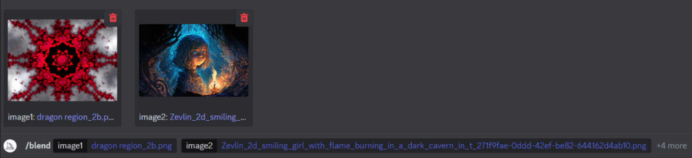

## Demostration of Midjourney's "/blend" and "/describe" commands. 

 - ## Midjourney will that first combines 2 images into one.  
 - ## Describe the image.  
 - ## Generate a whole new picture based on Midjourney's description.  

 

---
## First, I select my images to upload to Midjourney

### The first is fractal art I created in a program called Ultra Fractal.   Basically a the dragon region of mandelbrot set with kaleidoscope mapping applied.
> 

---

### I uploand another image previously created by Midjourney

> 

## Next step is to load the images into Midjourney's discord server using the "/blend" command
> 

## Midjourney "blends" the images together.

> 

## I choose to upgrade image #3 ...

> 

---
## Demostration of Midjourney's "/describe" command

### Midjourney attempts to describe the image I just blended.  
### I chose Midjourney's decription #4 

> ## "an image of a little girl dressed in red with lights, in the style of gothic illustration, symmetrical chaos, anime art, intricate psychedelic landscapes, psychological phenomena illustrations, dark azure, burned/charred"

> 

---
## MidJourney generates the images based on the description.
### ..and in this project I choose to upgrade #4
> 

---
## My Final image
### Final image created using the Midjourney's "/blend" and "/describe" command functions
---

